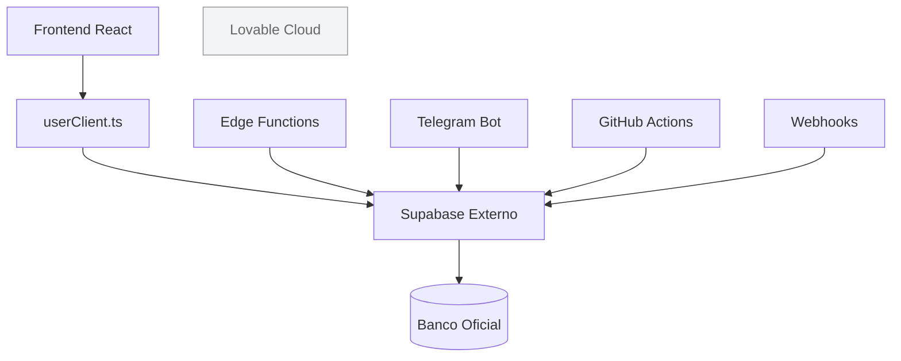

# EmprestAI

Aplicativo de controle de empréstimos e finanças pessoais.

---

# Arquitetura do Banco de Dados

## Banco oficial do sistema

O sistema utiliza exclusivamente **um único banco de dados Supabase em produção**.

**Projeto:**

- Project Ref: `syyxnqzxqabeuqbuptkh`

**Frontend:**

- Client oficial: `src/integrations/supabase/userClient.ts`

**Variáveis utilizadas:**

- `VITE_EXTERNAL_SUPABASE_URL`
- `VITE_EXTERNAL_SUPABASE_ANON_KEY`

**Todos os módulos utilizam exclusivamente este client:**

- Hooks
- Repositories
- Components
- Services
- Edge Functions
- Bots Telegram
- GitHub Actions
- Webhooks
- Backups

> Nenhum código de aplicação deve criar outro client Supabase.

---

## Lovable Cloud

A Lovable Cloud permanece habilitada apenas porque faz parte da infraestrutura da plataforma.

**Projeto:**

- Project Ref: `lcjelojqxpnphupsnmuq`

**Arquivo:**

- `src/integrations/supabase/client.ts`

**Status:**

- ❌ NÃO é utilizado pelo sistema.
- ❌ NÃO contém os dados oficiais do app.
- ❌ NÃO deve ser importado.

O arquivo existe apenas porque é gerado automaticamente pela Lovable.

---

## Regra obrigatória

Todo acesso ao banco deve utilizar exclusivamente:

```
src/integrations/supabase/userClient.ts
```

Nunca utilizar:

```
src/integrations/supabase/client.ts
```

A regra de ESLint (`no-restricted-imports`) protege essa arquitetura e impede imports acidentais.

---

## Como adicionar novas funcionalidades

Toda nova funcionalidade deve:

- importar apenas `userClient`;
- utilizar apenas o banco externo;
- nunca criar um novo `createClient`;
- nunca adicionar URLs ou chaves do Supabase diretamente no código;
- utilizar apenas as variáveis `VITE_EXTERNAL_SUPABASE_*`.

---

## Checklist para Pull Requests

- [ ] Nenhum novo `createClient` foi criado.
- [ ] Nenhum import de `src/integrations/supabase/client.ts`.
- [ ] Nenhuma URL do Supabase foi hardcoded.
- [ ] Nenhuma anon key foi hardcoded.
- [ ] Apenas `userClient.ts` foi utilizado.
- [ ] Build TypeScript sem erros.

---

## Arquitetura


